# SSL/TLS Cryptographic Protocol Solution and Load Balancing Using Nginx

*Demonstration of how to install an Nginx load balancer server and configure an SSL/TLS digital certificate by implementing HTTPS protocol to the load balancer for end-to-end encryption between web clients and servers. Additionally, we will register a new DNS name.* 

- *This project is a continuation of project:* 

https://github.com/Antonio447-cloud/jenkins-continuous-integration-project3

- *We will keep using "jenkins-continuous-integration-project3" EC2 instances to complete this project.*
-----------
    Happy learning!

## Outline

- Create an SSL/TLS digital certificate by implementing HTTPS protocol to the Nginx load balancer for end-to-end encryption between web clients and servers. 

- Register a new DNS name.

- Implement an Nginx load balancing solution to distribute network traffic efficiently between our DevOps tooling website's servers.

**NOTE**: *Load balancers act as reverse proxies and they can also be configured to block many common DDoS attacks, such as SYN floods or UDP reflection attacks that could possibly affect our DevOps tooling website.*

## SSL/TLS Cryptographic Protocol and Nginx Load Balancing

When data is moving between a web client (browser) and a web server over the internet, it passes through multiple network devices and, if the data is not encrypted, it can be relatively easy intercepted by someone who has access to intermediate equipment. This kind of information security threat is called Man-in-the-Middle (MITM) attack so:

- This threat could be a real issue because users that share sensitive information (bank details, social media access credentials, etc.) via non-secured channels, risk their data to be compromised and used by cybercriminals

- It is extremely important to ensure that the connections to our web solutions are secure and that the information is encrypted in transit.

SSL (Secure Socket Layer) and its newer version, TLS (Transport Layer Security) is a security technology that protects connections from MITM attacks by creating an encrypted session between browser and web server. We will refer to this family of cryptographic protocols as SSL/TLS:

- SSL/TLS uses a digital certificate to identify and validate a website. A browser reads the digital certificate issued by a Certificate Authority (CA) to make sure that the website is registered in the CA so it can be trusted to establish a secured connection.

- Even though SSL was replaced by TLS, the term is still being widely used.

**NOTE**: *There are different types of SSL/TLS certificates, so it is always a good idea to learn more about SSL/TLS. There are tons of resources on the internet on how these security protocols work.*

Our target architecture looks like this:

## Configuring Nginx as a Load Balancer and Registering a New DNS Name

We need to configure Nginx as a load balancer to point traffic to the resolvable DNS names of our web servers:

- So, to configure Nginx as a load balancer we will need to 
create an EC2 instance based on Ubuntu Server 20.04 and name it "Nginx-LB".
    
- Then we open TCP port 80 for HTTP connections, and we also open TCP port 443 since this port is used for secured HTTPS connections.

After connecting to our Nginx-LB instance and configuring its security groups as mentioned above, we register a new DNS name on "Route 53" on AWS. To do that we type "Route 53" on the AWS search bar:

Then we click on "Hosted zones":

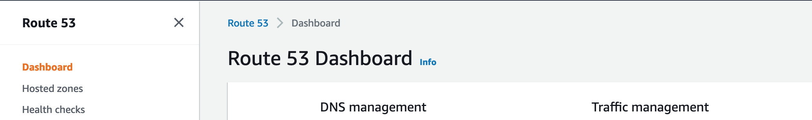

We create a hosted zone:

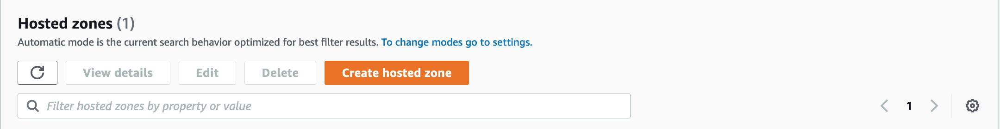

Now you need to type the domain name that you want for your DevOps tooling website. In my case I chose "toolingarp.click":

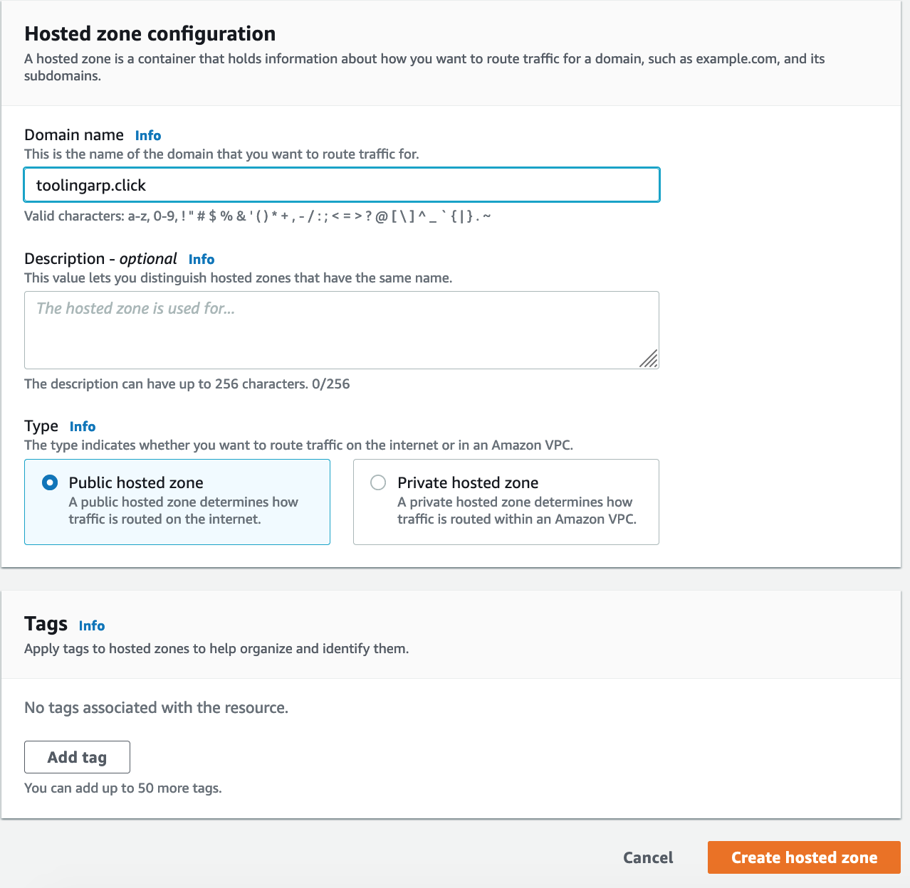

We create a record using our Ubuntu LB server public IP address:

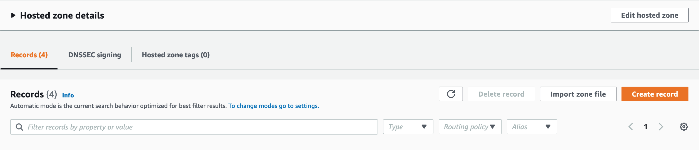

Now, you need to type the "Record name" that you want for your DevOps tooling website, and then paste the public IP address of your Nginx load balancer instance under "Value". Also, please make sure that the record type is set to "A":

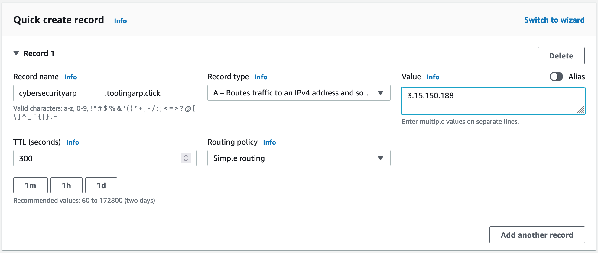

After completing the steps above, we SSH into our "Nginx-LB" EC2 instance and install Nginx:

`sudo apt update`

`sudo apt install nginx -y`

The we run:

`sudo systemctl enable nginx && sudo systemctl start nginx`

`sudo systemctl status nginx`

We update the /etc/hosts file for local DNS using the web servers’ internal DNS names (Web1 and Web2) that we configured into our LB server on project: "load-balancer-solution-with-apache-project2" with their respective private IP addresses:

`sudo vi /etc/hosts`

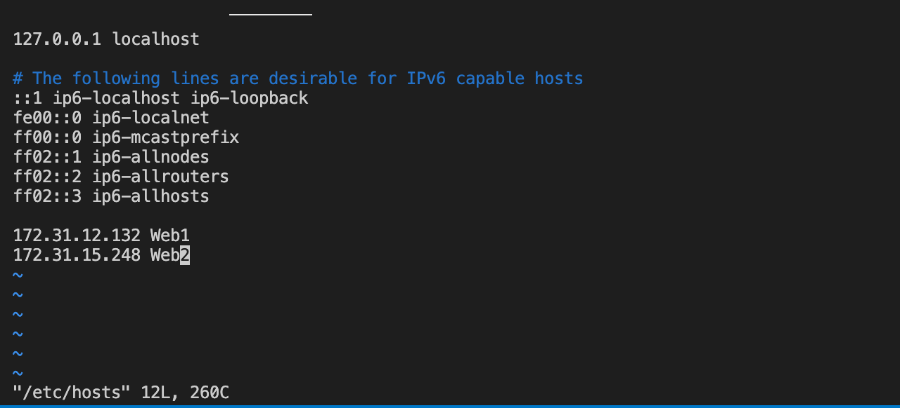

Then we input the following code on our /etc/nginx/nginx.conf file:

`sudo vi /etc/nginx/nginx.conf`

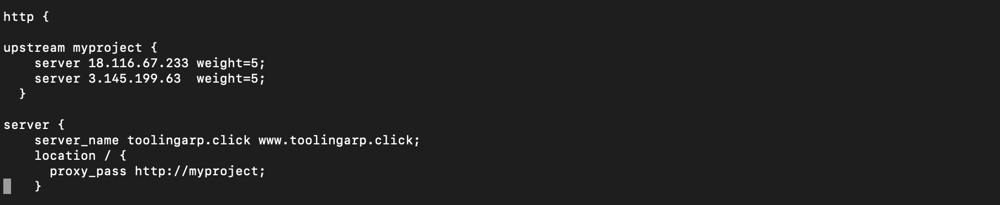

- *You need to paste the public ipv4 of your two web servers right after "server".*

- *You need to type your DNS name right after "server_name".*

Now we run:

`sudo rm -f /etc/nginx/sites-enabled/default`

To make make sure that everything looks fine we run:

`sudo nginx -t`

`cd /etc/nginx/sites-enabled`

`sudo ln -s ../sites-available/load_balancer.conf`

`ls`

`ll`

The output should look like this:

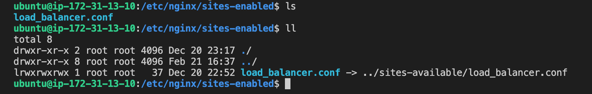

After verifying the output, we restart Nginx and verify that it is running: 

`sudo systemctl reload nginx`

`sudo systemctl status nginx`

## Deploying the Tooling Repository to our 2 Web Servers

Now we need to  SSH into our web server 1 instance. Once we have done so, we need to confirm that the "tooling" directory is on the web server. We deployed the tooling directory into our web server 1 on project: "devops-website-solution-with-nfs-lvm-project1". To verify if the tooling directory is on the web server we run:

`ls -l`

- **NOTE**: If you get a message that says: "ls: cannot access 'tooling': No such file or directory" you will need to install git and clone the repository where the tooling directory is located:

`sudo yum install git -y`

`git clone https://github.com/darey-io/tooling.git`

We verify that the repository was cloned:

`ls -l`

Now, we verify that the "html folder" is in the tooling directory:

`ls -l tooling/html`

Now we deploy the tooling website's code into the web server:

`sudo cp -R tooling/html/* /var/www/html/`

We make sure that the "html folder" from the repository was deployed to /var/www/html:

`ls -l /var/www/html`

`ls -l tooling/html`

Then we restart the web server and verify that it is up and running:

`sudo systemctl restart httpd`

`sudo systemctl status httpd`

- We repeat the steps listed on the heading: **"Deploying the Tooling Repository to our 2 Web Servers"** for web server 2.

## Registering a New Domain Name and Configuring Secured Connections Using SSL/TLS Certificates

Finally, we will make necessary configurations to make connections to our DevOps tooling website secure!

First, check that the web servers can be reached from the browser using your domain name: 

`http://<your-domain-name>.<your-tld>`

Once we can open our DevOps tooling website, in our Nginx LB instance we install certbot and request for an SSL/TLS certificate:

`sudo apt install certbot`

`sudo apt install python3-certbot-nginx -y`

`sudo nginx -t && sudo nginx -s reload`

`sudo certbot --nginx -d <your-domain-name>.<your-tld> -d www.<your-domain-name>.<your-tld>`

In my case:

`sudo certbot --nginx -d toolingarp.click -d www.toolingarp.click`

Once you run those commands you will be prompted to enter your email address, so type it in and agree. You well get the following message:

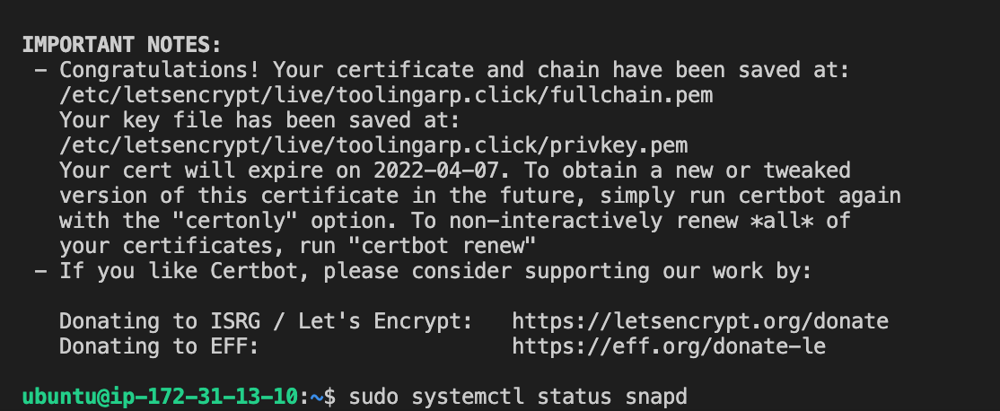

Now make sure snapd service is active and running:

`sudo systemctl status snapd`

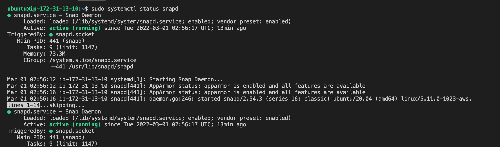

We need set up periodical renewal of our SSL/TLS certificate. By default, LetsEncrypt certificate is valid for 90 days, so it is recommended to renew it at least every 60 days or more frequently.

To do so, we need to edit the crontab file with the following command:

`crontab -e`

Then choose `1`

And add following line:

`* */12 * * *   root /usr/bin/certbot renew > /dev/null 2>&1`

- **NOTE**: *We can always change the interval of this cronjob.*

- *The output should look like this:*

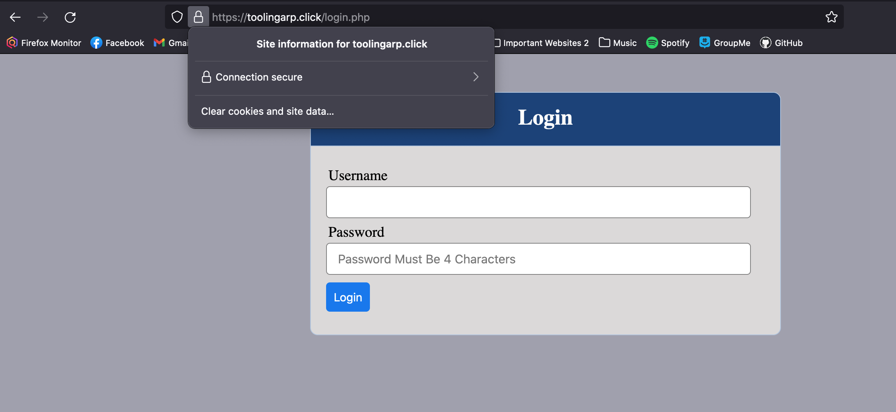

We have just implemented an Nginx load balancing web solution using a secure HTTPS connection with periodically updated SSL/TLS certificates as well as creating a new DNS record using AWS Route 53 for our website!

----------
## Self-Side Study Information for This Project

*Refreshing cron configuration:*

https://www.youtube.com/watch?v=4g1i0ylvx3A

*HTTP load balancing methods and features supported by Nginx:*

https://docs.nginx.com/nginx/admin-guide/load-balancer/http-load-balancer/.

*Allocating an Elastic IP and associate it with an EC2 server:*

https://docs.aws.amazon.com/AWSEC2/latest/UserGuide/elastic-ip-addresses-eip.html

*Updating a record in our registrar to point to Nginx LB using an Elastic IP address:*

https://www.cloudflare.com/learning/dns/dns-records/dns-a-record/

*Associating a domain name to an Elastic IP:*

https://medium.com/progress-on-ios-development/connecting-an-ec2-instance-with-a-godaddy-domain-e74ff190c233

*DNS record types:*

https://www.cloudflare.com/learning/dns/dns-records/

*Data encryption in transit:*

https://security.berkeley.edu/data-encryption-transit-guideline

*Public key certificates:*

https://en.wikipedia.org/wiki/Public_key_certificate

*Different types of SSL/TLS certificates:*

https://blog.hubspot.com/marketing/what-is-ssl

*Tutorial on how SSL/TLS works*: 

https://blog.hubspot.com/marketing/what-is-ssl

*Additional SSL/TLS resource:* 

https://blog.hubspot.com/marketing/what-is-ssl

*LetEncrypt website:*

https://letsencrypt.org/

*Shell client recommended by shell encrypt:*

https://certbot.eff.org/
